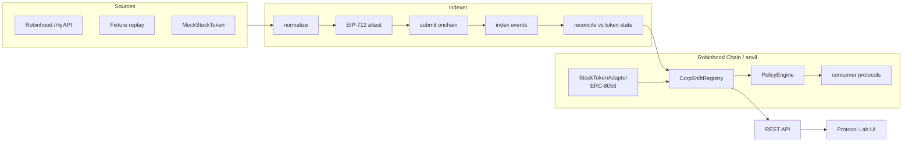

# CorpShift

Public demo: **https://corpshift.tangvu.dev** — repeatable Anvil lab and separately linked Robinhood testnet deployment evidence.

**The corporate-action runtime for onchain finance.**

Stock Tokens are programmable — but corporate actions change their *economic
meaning*. A 4:1 split moves the ERC-8056 `uiMultiplier` from `1e18` to `4e18` and
the per-economic-share price from $100 to $25. A protocol that combines raw
`balanceOf()` units with that per-share price now undervalues collateral by
4× and can **wrongfully liquidate healthy positions**. A price feed already
normalized per raw token has a different basis and must not be multiplied twice.

CorpShift keeps DeFi economically correct when the stock underneath a Stock
Token changes. It normalizes corporate actions into a canonical schema,
attests them with EIP-712, lands them in an onchain `ActionRegistry`, tracks a
per-asset state machine, verifies the expected normalization factor against
live token state, and exposes **policy hooks** + **normalized economic
exposure** that downstream protocols gate on.

```
Robinhood Stock Token (ERC-8056)          corporate-action source
        +  uiMultiplier / pending state           (Robinhood /rhj API,
        +  price reference                         fixture, or mock)
                        ↓
              CorpShift normalization engine  →  canonical action
              EIP-712 attestation             →  onchain registry
              state machine + factor verify   →  normalized asset state
                        ↓
        policy hooks · economic exposure → lending / vault / wallet / agent
```

---

## Quickstart — the killer demo in one command

Requires Node ≥ 24 and [Foundry](https://getfoundry.sh) (or Docker, below).

```bash
pnpm install
pnpm demo          # anvil → deploy → indexer → api → web (all real)
# open http://localhost:8056/lab
pnpm demo:check    # deterministic acceptance run (13 assertions)
```

Or fully containerized:

```bash
docker compose up --build   # then open http://localhost:8056/lab
```

**What the demo proves — with real transactions, not a simulation:**

| | NaiveVault (reads `balanceOf`) | CorpShiftAwareVault (reads CorpShift) |
|---|---|---|
| Deposit 10 stk, borrow $400 | ✅ HF 2.00 | ✅ HF 2.00 |
| 4:1 split attested (`ACTION_PENDING`) | allows more borrowing | **blocks** new borrows |
| Split executes: mult 4×, price $25 | sees collateral $250 → **liquidates a healthy position** | sees 40 econ units → $1,000 → **HF 2.00, untouched** |

Same user, same collateral, same corporate action — diametrically opposed
outcomes, each step a real onchain transaction you can verify.

---

## What's in the box

| Layer | Where | What |
|---|---|---|
| Contracts | `packages/contracts` | `CorpShiftRegistry`, `PolicyEngine`, ERC-8056 + ERC-20 adapters, `SettlementVault`, EIP-712 `AttestationLib`, mocks + demo vaults — **61/61 forge tests** |
| Canonical core | `packages/core` | `corpshift.action.v1` zod schema, canonicalization + action-id hashing, EIP-712 encoding (digest verified byte-for-byte against Solidity), Robinhood `/rhj` normalizer |
| SDK | `packages/sdk` | `CorpShiftClient` — typed reads, policy checks, normalized exposure, attestation signing + registry writes |
| Indexer | `apps/indexer` | `fetch → normalize → attest → submit → index events → reconcile` pipeline; sources: live Robinhood API, fixture replay, mock; SQLite (`node:sqlite`, zero-dep) |
| API | `apps/api` | Hono REST: assets, actions, policy gates, normalized exposure, event log, demo conductor — `openapi.yaml` |
| Web | `apps/web` | Vite + React + Tailwind: landing, assets, actions, policy playground, **Protocol Lab** |
| Demo | `scripts/` | `demo.mjs` (stack orchestrator), `demo-check.mjs` (acceptance assertions) |
| E2E | `test/e2e` | Playwright — drives the full killer scenario through the real UI |

## Architecture



The asset state machine — `ACTIVE → ACTION_PENDING → ADJUSTING → ACTIVE`,
with `HALTED`, `MIGRATING`, `REDEEMING`, `DEGRADED`, `UNSUPPORTED` — is enforced
onchain and mirrored in every API response. Full diagrams:
[docs/system-architecture.md](docs/system-architecture.md).

## Policy hooks

Consumer protocols ask one question before acting:

```solidity
(bool ok, bytes32 reason) = registry.checkPolicy(asset, CorpShiftTypes.PolicyOp.BORROW);
if (!ok) revert UnsafeAssetState(reason); // define this custom error in the consumer
uint256 units = registry.economicUnitsOfAmount(asset, rawBalance);
```

`ACTION_PENDING`, `ADJUSTING`, `HALTED`, `MIGRATING`, `REDEEMING` each carry an
explicit op matrix — e.g. borrows and liquidations are blocked while an
economic action is pending or unreconciled, and only risk-reducing exits stay
open in `DEGRADED`/`UNSUPPORTED`. The naive vault skips this entirely; that is
the exploit the demo makes objective.

## Attestation security

Canonical actions land onchain only with an EIP-712 signature from a
registry-authorized attester — domain-bound to `(chainId, registry)`, covering
`schema || actionId || asset || type || effectiveAt || paramsHash ||
evidenceHash`. Cross-chain, cross-contract, tampered-params, malleable-`s`,
revoked-signer, and replay vectors are all revert-tested. Trust model:
[docs/threat-model.md](docs/threat-model.md).

## Verification status

| Suite | Result |
|---|---|
| `forge test` | **61/61** — unit, fuzz, integration, handler-based invariants (48 runs / 576 calls / 0 reverts) |
| `pnpm test` | **44/44** vitest across core, shared, sdk, indexer, api |
| `pnpm demo:check` | **13/13** — full scenario on live anvil: seeded, attested, probed, executed, reconciled, naive seized, aware HF 2.00 |
| `pnpm e2e` | **8/8** Playwright — real-chain scenario, failure handling, interactive illustration, mobile layouts and navigation |
| `forge fmt --check` · `pnpm lint` · `pnpm typecheck` · `pnpm format:check` | clean |

Install the browser once before E2E checks: `pnpm exec playwright install chromium --only-shell`.

## Deploying to Robinhood Chain testnet

Chain id `46630`, RPC `https://rpc.testnet.chain.robinhood.com`, faucet at
`https://faucet.testnet.chain.robinhood.com`. Full guide:
[docs/deployment-guide.md](docs/deployment-guide.md).

## Docs

- [System architecture](docs/system-architecture.md) — state machine, pipeline, sequence diagrams
- [Deployment guide](docs/deployment-guide.md) — local, docker, testnet
- [Threat model](docs/threat-model.md) — trust assumptions + mitigations
- [Benchmarks](docs/benchmarks.md) — gas + latency numbers
- [Research notes](docs/research/README.md) — Robinhood Chain / ERC-8056 facts, verified live
- [Winner benchmark](docs/research/winner-benchmark.md) — sourced comparisons and submission priorities
- [Integration guide](docs/integration-guide.md) — policy gates, valuation units, and verification
- [API reference](apps/api/openapi.yaml) — OpenAPI 3.1

## License

MIT
