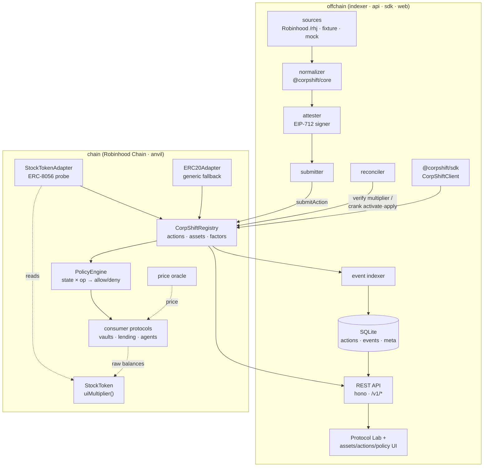
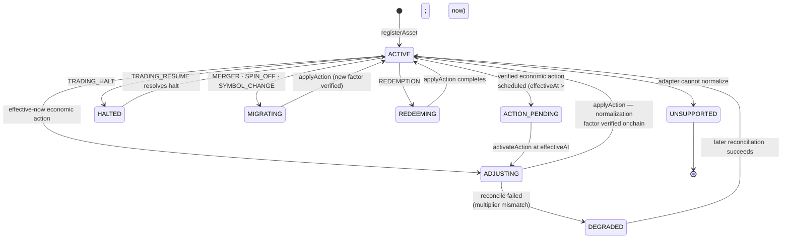
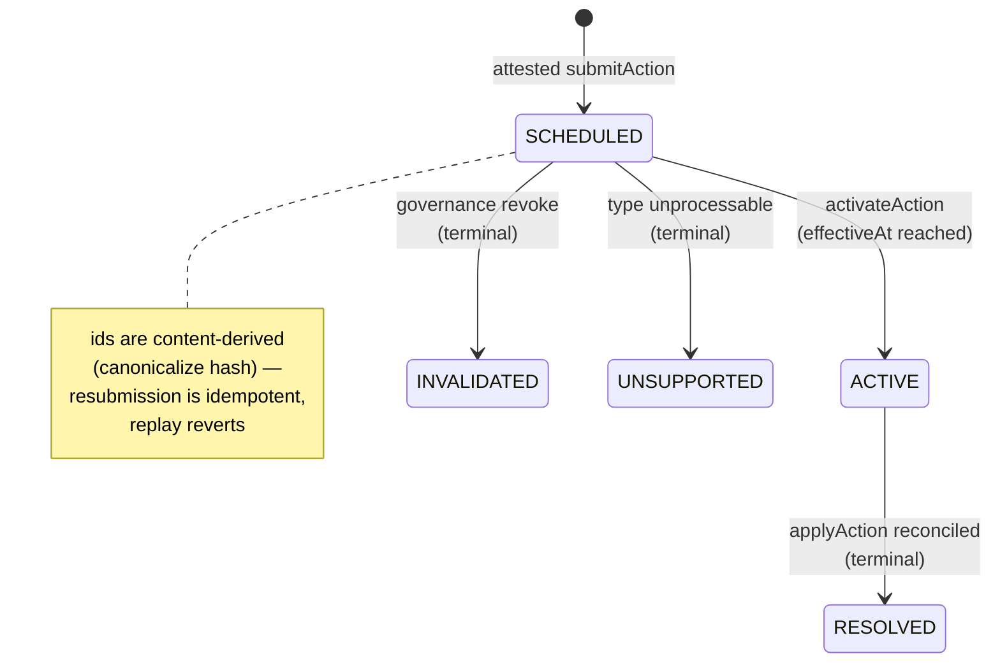
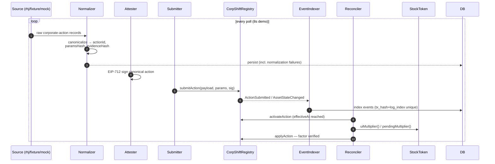
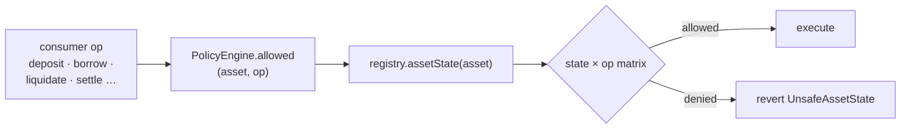

# System architecture

CorpShift turns messy real-world corporate actions into a small number of
things onchain protocols can trust: a canonical action record, an asset state
machine, a verified normalization factor, and policy answers.

## Component view

## Asset state machine

One state per registered asset. Transitions are enforced by
`CorpShiftRegistry` — every transition emits `AssetStateChanged` with the
causal `actionId`, so the full history is auditable onchain.

`applyAction` verifies the expected `uiMultiplier` against live token state
before returning the asset to `ACTIVE`. If the token never updated — or moved
to an unexpected factor — the asset lands in `DEGRADED` and `PriceRead` is
denied, so consumers stop trusting stale valuations instead of guessing.

## Action lifecycle

## Ingestion pipeline

Failures are never dropped silently: records that fail normalization persist
with `status = -1` and the error, so the API can surface "we saw it but
couldn't canonicalize it" instead of pretending it never happened.

## Policy enforcement

The seeded defaults (governance can tighten per state × op via `setPolicy`):

| Asset state | Deposit | Withdraw | Borrow | Liquidate | Order | Settle | Transfer | Collateral | PriceRead |
|---|---|---|---|---|---|---|---|---|---|
| `ACTIVE` | ✅ | ✅ | ✅ | ✅ | ✅ | ✅ | ✅ | ✅ | ✅ |
| `ACTION_PENDING` | ✅ | ✅ | ❌ | ❌ | ❌ | ❌ | ✅ | ❌ | ✅ |
| `ADJUSTING` | ❌ | ❌ | ❌ | ❌ | ❌ | ❌ | ❌ | ❌ | ✅ |
| `HALTED` | ✅ | ✅ | ❌ | ❌ | ❌ | ❌ | ❌ | ❌ | ✅ |
| `MIGRATING` | ❌ | ✅ | ❌ | ❌ | ❌ | ❌ | ❌ | ❌ | ✅ |
| `REDEEMING` | ❌ | ✅ | ❌ | ❌ | ❌ | ✅ | ❌ | ❌ | ✅ |
| `DEGRADED` | ❌ | ✅ | ❌ | ❌ | ❌ | ❌ | ❌ | ❌ | ✅ |
| `UNSUPPORTED` | ❌ | ✅ | ❌ | ❌ | ❌ | ❌ | ❌ | ❌ | ✅ |

The matrix encodes one principle: **while economic meaning is in flux, the
only safe operation is the one that reduces exposure.** Withdrawals and price
reads stay open in every state; anything that creates new risk — borrows,
orders, liquidations — waits for verified state. `PRICE_READ` staying
permitted is deliberate: consumers should keep *seeing* the asset, just not
*act* on it.

## Trust boundaries

- **Attesters** — registry-authorized EIP-712 signers; the only path a
  canonical action takes onchain. Compromise ⇒ forged actions; mitigated by
  domain binding, content-derived ids, replay reverts, onchain factor
  verification, and governance revoke (`invalidateAction`).
- **Token contract** — `uiMultiplier`/`newUIMultiplier`/`effectiveAt` are the
  ground truth; the registry *verifies* rather than *asserts* economic
  factors. A lying adapter cannot push an asset to `ACTIVE` on a false factor.
- **Oracle** — consumers choose their own; CorpShift never touches prices.
  The demo's mock oracle exists only to make the 4:1 split visible.
- **Governance** — asset registration, attester management, invalidation.
  Deliberately minimal: no pause that could freeze consumer `WITHDRAW`.

See [threat-model.md](threat-model.md) for the full analysis.
